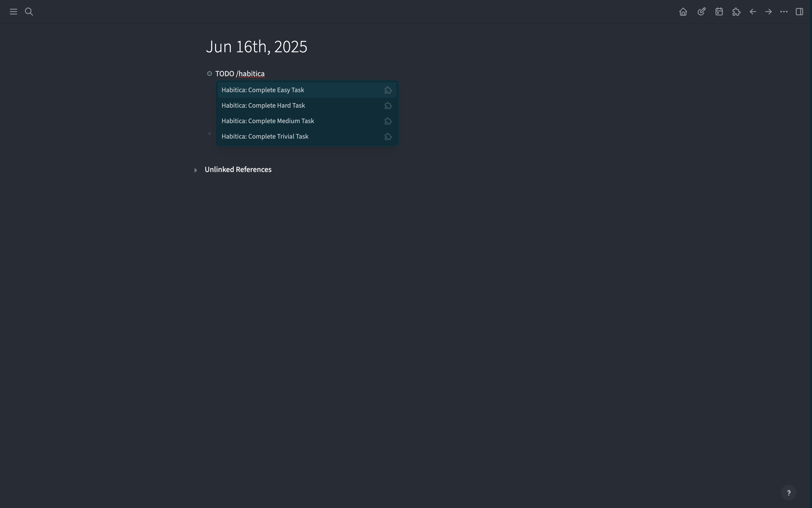
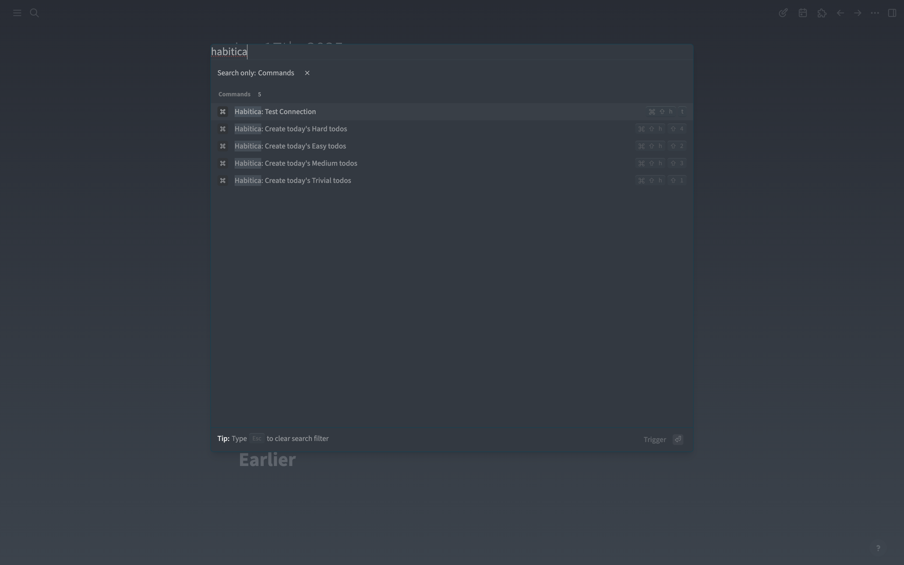
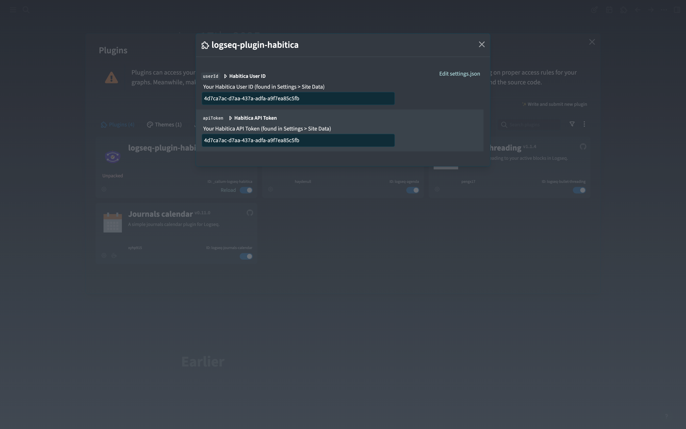

# Logseq Habitica Plugin 🎮

A plugin that integrates Logseq tasks with Habitica!

## ✨ Features

- 🎯 **Smart Task Sync** - Automatically create Logseq TODO tasks in Habitica
- 🏆 **Four Priority Levels** - Support for Trivial, Easy, Medium, and Hard priority settings
- ⚡ **Real-time Completion Sync** - Automatically complete tasks in Habitica when marked DONE in Logseq
- 🚀 **Batch Operations** - One-click creation of all today's TODO tasks
- 🔒 **Secure & Reliable** - Follows Habitica API usage guidelines with built-in rate limiting protection

## 🎯 Usage

### Configure Plugin
1. Find "Habitica Plugin" in Logseq settings
2. Paste your **User ID** and **API Token**
3. Use `Ctrl+Shift+H T` to test connection

### Single Task Creation (Slash Commands)
Use slash commands in any TODO block:
- `/Habitica: Create Trivial Task` - Create trivial task (yellow)
- `/Habitica: Create Easy Task` - Create easy task (orange)
- `/Habitica: Create Medium Task` - Create medium task (red)
- `/Habitica: Create Hard Task` - Create hard task (purple)

### Batch Creation (Keyboard Shortcuts)
- `Ctrl+Shift+H + 1` - Batch create trivial tasks
- `Ctrl+Shift+H + 2` - Batch create easy tasks
- `Ctrl+Shift+H + 3` - Batch create medium tasks
- `Ctrl+Shift+H + 4` - Batch create hard tasks

### Test Connection
- `Ctrl+Shift+H + T` - Test Habitica connection

## 📄 License

MIT License
